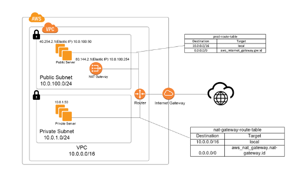

# AWS Terraform
## Introduction

### Design Explanation
- VPC has two subnets – one private and one public
- Both subnet’s route management is done by a router. The router will have routing tables to control routes between the subnet and the internet
- Internet Gateway connects VPC to the internet.
- NAT gateway handles private subnet’s AWS service requests by forwarding its request to Internet Gateway.
- prod-route-table contains the routing table for the public subnet which directly connects the public subnet to the internet gateway and other local networks.
- To make private subnet access the AWS services routing table “nat-gateway-route-table” send all internet requests to NAT gateway.

# Terraform Command Basics
- Terraform Commands
    - terraform init
    - terraform validate
    - terraform plan
    - terraform apply
    - terraform destroy